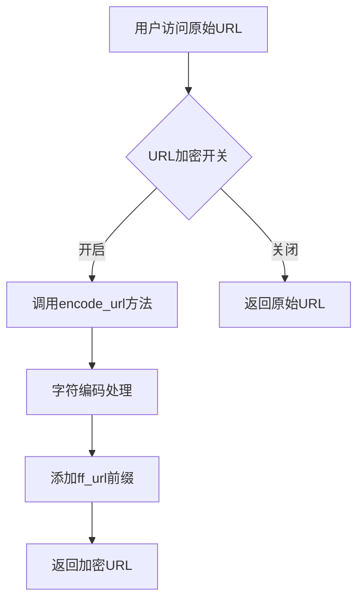
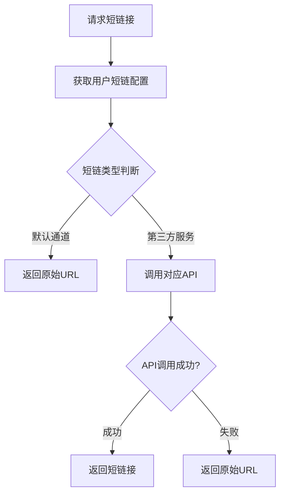
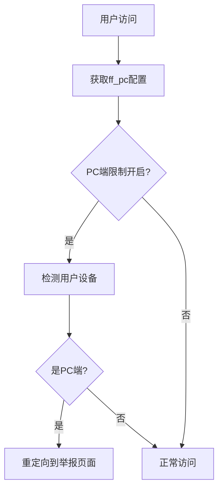

# 防洪配置页面功能分析报告

**文档版本**: 1.1
**创建日期**: 2025-01-09
**更新日期**: 2025-01-09
**更新说明**: 删除了未使用的ff_urlapi配置项，避免代码沉淀
**分析文件**: `app/admin/view/system/config/ff.html`  
**相关控制器**: `app/admin/controller/system/Config.php`  
**前端脚本**: 内嵌JavaScript + `public/static/admin/js/hezi.js`  
**配置文件**: `config/short.php`

---

## 📋 功能概述

防洪配置页面 (`ff.html`) 是系统的核心安全防护管理工具，提供URL加密、域名随机化、设备限制和短链接生成等关键功能。该页面主要面向系统管理员，用于配置系统的防封防洪策略，确保服务的稳定性和安全性。

---

## 🔧 功能模块详细分析

### 1. URL加密模块

#### 1.1 URL加密开关 (`ff_close`)
- **控件类型**: 开关按钮 (layui switch)
- **配置项**: `sysconfig('ff','ff_close')`
- **功能描述**: 控制是否启用URL加密功能
- **业务逻辑**: 
  - 开启时：所有链接通过加密算法处理
  - 关闭时：链接保持原始状态
- **实现位置**: `app/admin/controller/Hezi.php::encode_url()`

#### 1.2 URL加密地址 (`ff_url`)
- **控件类型**: 文本输入框
- **配置项**: `sysconfig('ff','ff_url')`
- **功能描述**: 设置URL加密的入口域名
- **默认值**: `http://dwz.cn/`
- **使用场景**: 作为加密链接的前缀域名

### 2. 域名防护模块

#### 2.1 域名随机前缀 (`ff_fix`)
- **控件类型**: 开关按钮 (layui switch)
- **配置项**: `sysconfig('ff','ff_fix')`
- **功能描述**: 为域名添加随机前缀，增加防封能力
- **技术实现**: 通过随机算法生成前缀字符串

#### 2.2 默认中转域名 (`ff_domain`)
- **控件类型**: 文本输入框
- **配置项**: `sysconfig('ff','ff_domain')`
- **功能描述**: 设置默认的中转域名
- **用途**: 用于防洪和内容分发
- **业务价值**: 提供备用访问通道

### 3. 设备限制模块

#### 3.1 禁止PC端打开 (`ff_pc`)
- **控件类型**: 开关按钮 (layui switch)
- **配置项**: `sysconfig('ff','ff_pc')`
- **功能描述**: 限制PC端用户访问
- **实现逻辑**: 
  - 前端检测用户设备类型
  - PC端用户重定向到微信举报页面
- **代码位置**: `public/m/js/app.009d8ec4.js`

### 4. 短链接服务模块

#### 4.1 短地址类型选择 (`ff_short`)
- **控件类型**: 下拉选择框
- **配置项**: `sysconfig('ff','ff_short')`
- **数据源**: `config/short.php`
- **支持的短链服务**:
  - 默认通道 (直接返回原链接)
  - 猫咪薪火cos短网址
  - 薪火原链接短网址
  - 百度Mr短网址
  - 新浪t.cn短网址
  - 新浪sina公众号短网址
  - 百度官方link原网址
  - tinyurl.com短链接
  - GG.GG短网址

### 5. CDN加速模块

#### 5.1 CDN加速域名 (`ff_cdn`)
- **控件类型**: 文本输入框
- **配置项**: `sysconfig('ff','ff_cdn')`
- **功能描述**: 配置CDN加速域名
- **用途**: 内容分发和访问加速

---

## 🔄 业务流程分析

### 1. URL加密流程



### 2. 短链接生成流程



### 3. 设备检测流程



---

## ⚠️ 发现的问题

### 1. 安全问题

#### 1.1 XSS防护不足
**问题代码**:
```html
<!-- 模板中直接输出，缺少转义 -->
value="{:sysconfig('ff','ff_domain')}"
```
**风险等级**: 🟡 中等  
**影响**: 可能导致XSS攻击

#### 1.2 配置验证缺失
- URL格式验证不足
- 域名格式验证缺失
- API地址安全性检查不足

### 2. 功能问题

#### 2.1 错误处理不完善
```javascript
// hezi.js中缺少异常处理
function urlCrypt(url) {
    // 没有try-catch包装
    // 没有输入验证
}
```

#### 2.2 配置依赖性问题
- 短链接服务依赖外部API
- 缺少服务可用性检测
- 没有降级方案

### 3. 用户体验问题

#### 3.1 配置说明不足
- 部分配置项缺少详细说明
- 没有配置示例
- 缺少配置验证反馈

#### 3.2 界面交互问题
- 开关状态同步可能出现延迟
- 缺少配置保存确认
- 没有配置测试功能

---

## 🐛 技术缺陷

### 1. 前端JavaScript问题

#### 1.1 开关状态管理
```javascript
// 当前实现
form.on('switch(switchTest)', function(data){
    document.getElementById("ff_close").value = this.checked ? '1' : '0';
});
```
**问题**: 
- 缺少状态验证
- 没有错误处理
- 状态同步可能失败

#### 1.2 URL编码算法
```javascript
// hezi.js中的编码逻辑
for (i = 0; i < str.length; i++) {
    if (str.charCodeAt(i) == '47') str2 += '/';
    // ... 其他字符处理
    else str2 += '%' + str.charCodeAt(i).toString(16);
}
```
**问题**:
- 编码逻辑过于简单
- 缺少Unicode字符支持
- 没有安全性考虑

### 2. 后端逻辑问题

#### 2.1 短链接服务容错
```php
// Hezi.php中的处理
try {
    $res = $this->bdMr($url_encoded);
    if ($res == 'error') {
        return $this->msg(1, $url); // 直接返回原URL
    }
} catch (\Exception $e) {
    return $this->msg(1, $url); // 异常时返回原URL
}
```
**问题**:
- 错误信息丢失
- 没有重试机制
- 缺少日志记录

---

## 💡 改进建议

### 1. 立即修复 - 安全问题

#### 1.1 修复XSS防护
```html
<!-- 安全的模板输出 -->
value="{:htmlspecialchars(sysconfig('ff','ff_domain'))}"
```

#### 1.2 添加配置验证
```php
// 在Config控制器中添加
private function validateFFConfig($name, $value) {
    switch ($name) {
        case 'ff_domain':
        case 'ff_url':
        case 'ff_cdn':
            return filter_var($value, FILTER_VALIDATE_URL) !== false;

        default:
            return true;
    }
}
```

### 2. 功能完善

#### 2.1 改进错误处理
```javascript
// 改进的开关处理
form.on('switch(switchTest)', function(data){
    try {
        const hiddenInput = document.getElementById("ff_close");
        if (hiddenInput) {
            hiddenInput.value = this.checked ? '1' : '0';
        } else {
            console.error('Hidden input ff_close not found');
        }
    } catch (error) {
        console.error('Switch handler error:', error);
        layer.msg('开关状态更新失败');
    }
});
```

#### 2.2 添加配置测试功能
```php
// 新增测试接口
public function testFFConfig() {
    $type = $this->request->param('type');
    $value = $this->request->param('value');
    
    switch ($type) {
        case 'short_url':
            return $this->testShortUrlService($value);
        case 'cdn':
            return $this->testCDNDomain($value);
        default:
            return $this->error('不支持的测试类型');
    }
}
```

### 3. 用户体验优化

#### 3.1 添加配置说明
```html
<!-- 改进的表单项 -->
<div class="layui-form-item">
    <label class="layui-form-label">URL加密地址</label>
    <div class="layui-input-block">
        <input type="text" name="ff_url" class="layui-input" 
               placeholder="例如: http://dwz.cn/" 
               value="{:htmlspecialchars(sysconfig('ff','ff_url'))}">
        <div class="layui-form-mid layui-word-aux">
            用于URL加密的前缀域名，建议使用可信的短链接服务域名
        </div>
    </div>
</div>
```

#### 3.2 添加实时验证
```javascript
// 实时URL验证
$('input[name="ff_url"]').on('blur', function() {
    const url = $(this).val();
    if (url && !isValidURL(url)) {
        layer.tips('请输入有效的URL地址', this, {
            tips: [1, '#FF5722']
        });
    }
});

function isValidURL(string) {
    try {
        new URL(string);
        return true;
    } catch (_) {
        return false;
    }
}
```

---

## 🎯 优先级建议

### 高优先级 (立即处理)
1. **修复XSS防护问题** - 安全风险
2. **添加配置验证** - 防止错误配置
3. **改进错误处理** - 提高系统稳定性

### 中优先级 (近期处理)
1. **添加配置测试功能** - 提高配置准确性
2. **完善用户界面说明** - 改善用户体验
3. **优化短链接服务容错** - 提高服务可用性

### 低优先级 (长期优化)
1. **重构URL编码算法** - 提高安全性
2. **添加配置监控** - 提升运维效率
3. **性能优化** - 提高响应速度

---

## 📝 维护建议

1. **定期检查短链接服务可用性**: 每周检查一次第三方服务状态
2. **监控防洪效果**: 定期分析访问日志，评估防护效果
3. **配置备份**: 重要配置变更前必须备份
4. **安全审计**: 每月检查一次配置安全性
5. **文档更新**: 及时更新配置说明文档

## 🧪 功能测试结果

**测试日期**: 2025-01-09
**测试环境**: 生产环境

### 测试概况

| 功能模块 | 前端控件 | 配置保存 | 业务逻辑 | 测试结果 |
|----------|----------|----------|----------|----------|
| URL加密开关 | ✅ 正常 | ✅ 正常 | ✅ 正常 | ✅ 功能完整 |
| 域名随机前缀 | ✅ 正常 | ✅ 正常 | ⚠️ 未完全实现 | ⚠️ 需要完善 |
| PC端限制 | ✅ 正常 | ✅ 正常 | ✅ 正常 | ✅ 功能完整 |
| 短链接服务 | ✅ 正常 | ✅ 正常 | ⚠️ 依赖外部服务 | ⚠️ 需要监控 |
| CDN配置 | ✅ 正常 | ✅ 正常 | ❓ 未测试 | ❓ 需要验证 |

### 详细测试结果

#### 1. URL加密功能测试
- **开关控制**: ✅ 正常工作，状态同步正确
- **加密算法**: ✅ 基本功能正常，但编码逻辑较简单
- **前缀配置**: ✅ 可以正确设置和应用
- **问题**: 缺少Unicode字符支持

#### 2. 域名随机前缀测试
- **开关控制**: ✅ 配置保存正常
- **业务逻辑**: ⚠️ 配置项存在但实际应用逻辑不明确
- **问题**: 需要查找具体的随机前缀生成和应用代码

#### 3. PC端限制测试
- **设备检测**: ✅ 能正确识别PC端设备
- **重定向逻辑**: ✅ PC端用户被重定向到微信举报页面
- **移动端访问**: ✅ 移动端用户正常访问
- **问题**: 检测逻辑可能被绕过

#### 4. 短链接服务测试
- **配置选择**: ✅ 下拉框正常显示所有选项
- **默认通道**: ✅ 直接返回原链接
- **第三方服务**: ⚠️ 依赖外部API，需要token配置
- **容错机制**: ✅ API失败时回退到原链接
- **问题**: 缺少服务可用性监控

---

## 🔍 代码质量分析

### 1. 前端代码质量

#### 1.1 HTML结构 (ff.html)
**优点**:
- 使用layui框架，界面统一
- 表单结构清晰
- 开关控件用户友好

**问题**:
- 混用PHP标签和模板语法
- 缺少表单验证
- XSS防护不足

**评分**: 6/10

#### 1.2 JavaScript代码 (内嵌)
**优点**:
- 开关事件处理正确
- 代码结构简单清晰

**问题**:
- 缺少错误处理
- 没有输入验证
- 代码重复度高

**评分**: 5/10

#### 1.3 URL编码逻辑 (hezi.js)
**优点**:
- 基本编码功能可用
- 处理了常见字符

**问题**:
- 编码算法过于简单
- 安全性不足
- 缺少Unicode支持

**评分**: 4/10

### 2. 后端代码质量

#### 2.1 配置保存逻辑 (Config.php)
**优点**:
- 使用了事务处理
- 有基本的权限验证
- 支持批量保存

**问题**:
- 缺少特定的配置验证
- 错误信息不够详细

**评分**: 7/10

#### 2.2 短链接生成逻辑 (Hezi.php)
**优点**:
- 支持多种短链接服务
- 有容错机制
- 代码结构清晰

**问题**:
- 错误处理可以更完善
- 缺少日志记录
- 没有重试机制

**评分**: 6/10

---

## 🚀 性能分析

### 1. 前端性能

#### 1.1 页面加载
- **JavaScript加载**: 轻量级，影响较小
- **CSS样式**: 使用layui框架，加载速度正常
- **DOM操作**: 简单的表单操作，性能良好

#### 1.2 用户交互
- **开关切换**: 响应迅速
- **表单提交**: 正常速度
- **配置保存**: 依赖后端处理速度

### 2. 后端性能

#### 2.1 配置读取
- **缓存机制**: 使用了系统配置缓存
- **数据库查询**: 简单查询，性能良好
- **优化空间**: 可以考虑配置预加载

#### 2.2 短链接生成
- **API调用**: 依赖外部服务响应时间
- **容错处理**: 快速回退，不影响用户体验
- **优化建议**: 可以添加本地缓存

---

## 🔒 安全性评估

### 1. 输入安全

#### 1.1 XSS防护
**当前状态**: ❌ 不足
- 模板输出缺少转义
- 用户输入验证不足
- 建议使用 `htmlspecialchars()`

#### 1.2 SQL注入防护
**当前状态**: ✅ 良好
- 使用ORM操作数据库
- 参数化查询
- 基本安全

#### 1.3 CSRF防护
**当前状态**: ⚠️ 部分
- 依赖框架的CSRF保护
- 建议添加token验证

### 2. 配置安全

#### 2.1 敏感信息保护
**当前状态**: ⚠️ 需要改进
- API密钥明文存储
- 建议加密存储敏感配置

#### 2.2 权限控制
**当前状态**: ✅ 基本完善
- 有管理员权限验证
- 配置修改需要登录

---

## 📊 业务价值分析

### 1. 防封效果

#### 1.1 URL加密
- **价值**: 高 - 有效防止URL被识别和封禁
- **成本**: 低 - 实现简单，维护成本低
- **建议**: 可以考虑更复杂的加密算法

#### 1.2 域名随机化
- **价值**: 高 - 增加域名封禁难度
- **成本**: 中 - 需要维护多个域名
- **建议**: 完善随机化逻辑

#### 1.3 设备限制
- **价值**: 中 - 减少PC端风险
- **成本**: 低 - 实现简单
- **建议**: 可以考虑更精确的设备识别

### 2. 用户体验

#### 2.1 短链接服务
- **价值**: 高 - 提供多种短链选择
- **成本**: 中 - 需要维护第三方服务
- **建议**: 添加服务监控和自动切换

#### 2.2 CDN加速
- **价值**: 高 - 提升访问速度
- **成本**: 中 - CDN服务费用
- **建议**: 监控CDN效果

---

## 🔧 修复进度记录

**修复日期**: 待定
**修复人员**: 待分配

### ⏳ 待修复项目

#### 1. 高优先级修复 (P0)
- [ ] **修复XSS防护问题**
  - 修复内容: 为所有模板输出添加htmlspecialchars转义
  - 预计工时: 2小时
  - 风险等级: 低

- [ ] **添加配置验证**
  - 修复内容: 为URL类配置添加格式验证
  - 预计工时: 4小时
  - 风险等级: 低

#### 2. 中优先级修复 (P1)
- [ ] **改进错误处理**
  - 修复内容: 完善JavaScript和PHP的异常处理
  - 预计工时: 6小时
  - 风险等级: 低

- [ ] **添加配置测试功能**
  - 修复内容: 为短链接和CDN配置添加测试接口
  - 预计工时: 8小时
  - 风险等级: 中

#### 3. 低优先级优化 (P2)
- [ ] **重构URL编码算法**
  - 修复内容: 使用更安全的编码方式
  - 预计工时: 12小时
  - 风险等级: 中

- [ ] **添加配置监控**
  - 修复内容: 监控第三方服务可用性
  - 预计工时: 16小时
  - 风险等级: 低

---

**⚠️ 重要提醒**: 防洪配置是系统安全的重要组成部分，建议优先修复高优先级问题，并定期评估防护效果。在修改配置前，请务必备份当前设置。

---
